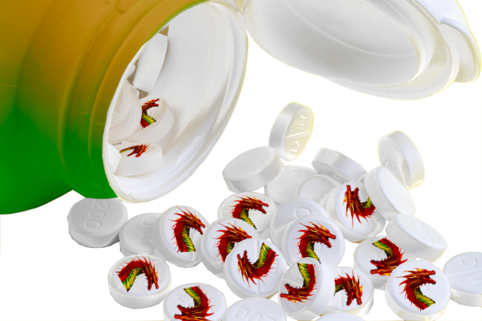

# dragon-tabs
Save and restore all tabs from toolbar popup!

Inspired by [Save Tabs](https://mybrowseraddon.com/save-tabs.html), completely rewritten with slightly different functionality.

## Purpose
If you're always out of memory and CPU because of too many open browser tabs, the best is to save them with a couple of clicks for read later.

### GUI and shortcuts
When you open the extension popup by clicking on the dragon, you get 2 buttons on the top: `Open tabs` and `Close tabs`. Under them there will be all opened urls listed.

* close tabs: saves and closes all your open tabs except the active one that stays open. You can also add a keyboard shortcut for that in <chrome://extensions/shortcuts>
* open tabs: reopens all of them
* actions only for open but non-active tabs:
  * clicking on the  icon removes the tab from the browser and the saved tabs
* actions only for the active tab:
  * the  icon replaces the current tab with a new blank one, removing the tab from the saved tabs
  * a settable keyboard shortcut in <chrome://extensions/shortcuts> may be added to close the current tab AND remove it from the saved ones. You can even override the current close tab shortcut (Ctrl+W on linux and windows)
* actions only for closed tabs:
  * clicking on the title line opens it
  * clicking on the  icon replaces the url of the active browser tab with the url of the chosen one
  * clicking on the  icon removes active url from the saved ones, and replaces it in the active browser tab with the chosen one. You can also add a shortcut for that in <chrome://extensions/shortcuts> that replaces current active url with the last saved url list.
* you can also add a shortcut in <chrome://extensions/shortcuts> to open the popup GUI
* lines may be reordered by dragging with the `☰` hamburger icon on the left

### Status
The extension seems to work, not battle-tested yet though. Feel free to create a PR or an issue.

### Screenshots

